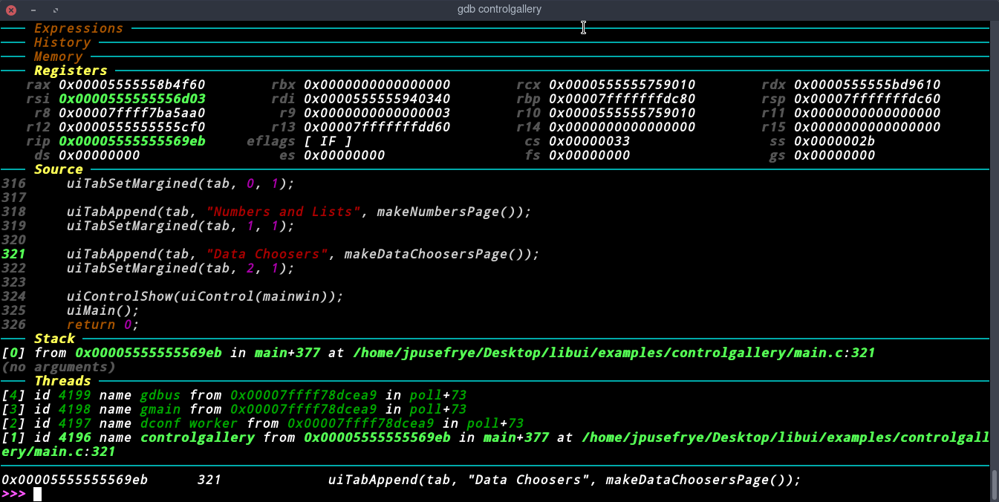

# My Personal Dotfiles

Running on Arch Linux

**NOTE**:
```
the [.bashrc/.zshrc] designed for arch linux
if you use other linux distro or OSX just remove PACMAN ALIASES section
and all wil be fine
if you use zsh you must have oh-my-zsh installed
```

# Screen Shot





you can find more screenshots at [screenshots.md](Screenshots.md)


# what inside this repo
in this repo there is my personal vim configuration that i use to code ([.vimrc](.vimrc)).

there is my [.gdbinit](.gdbinit) file that i use in debugging and reverse engineering, user interface from [GDB-Dashboard](https://github.com/cyrus-and/gdb-dashboard) extension and the configurations is by me and some people.

i used [.bashrc](.bashrc) alot for my shell but now i am [.zshrc](.zshrc) fan.

#### Required

- cowsay

- fortune

- figlet

- tput

### Installation

```shell
git clone https://github.com/JpUsefRye/Dotfiles.git && cd Dotfiles

chmod +x install.py

# to install the .vimrc run this command
$ (sleep 1; echo 1; cat) | python install.py vim

# to install vim tender colorscheme
$ (sleep 1; echo 2; echo 1; cat) | python install.py vim

# to install vim jellybeans colorscheme
$ (sleep 1; echo 2; echo 2; cat) | python install.py vim

# to install .bashrc
$ (sleep 1; echo 1; cat) | python install.py shell

# to install .zshrc (requires oh-my-zsh)
$ (sleep 1; echo 2; cat) | python install.py shell

```

### Contribution
all pull requests & issues are welcomed :)

### LICENSE
the whole repo is released under GPL3

this repo containing code from gdb-dashboard licensed on MIT
