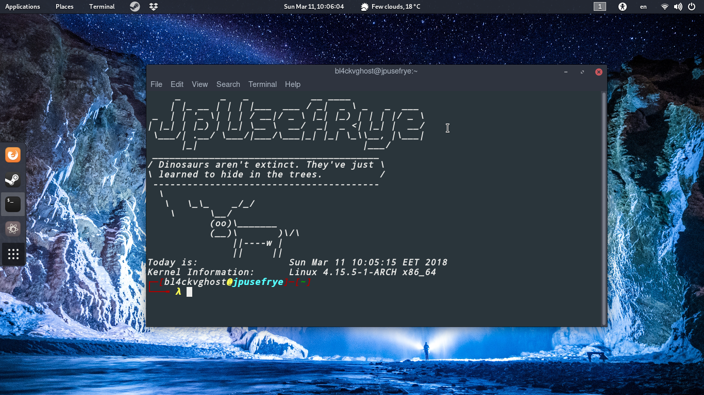
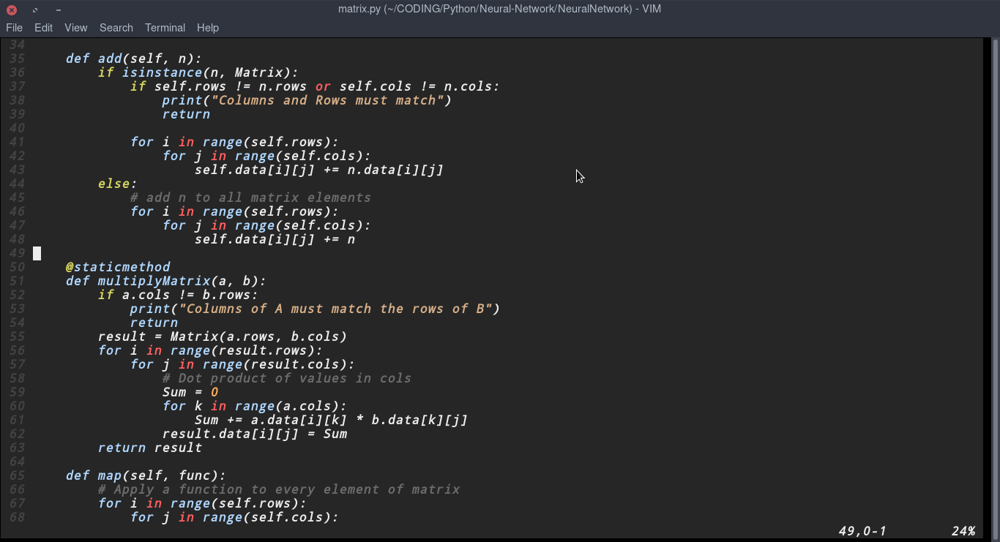

# My Personal Dotfiles

Running on Arch Linux

# Screen Shot

### Terminal


### Vim


#### Required

- cowsay

- fortune

- figlet

### Installation

```bash
# Download the Dotfiles
git clone https://github.com/JpUsefRye/Dotfiles.git
cd Dotfiles
# make a backup file
cp ~/.bashrc ~/.bashrc.bak
# apply the .bashrc file
cp .bashrc ~/.bashrc

# Apply to Vim

# make a backup
cp ~/.vimrc ~/.vimrc.bak

# install vimrc
cp .vimrc ~/.vimrc

# install the color scheme
# if you dont have .vim/colors folder create it
# then copy the tender.vim file to .vim/colors
cp tender.vim ~/.vim/colors

# Done
```
